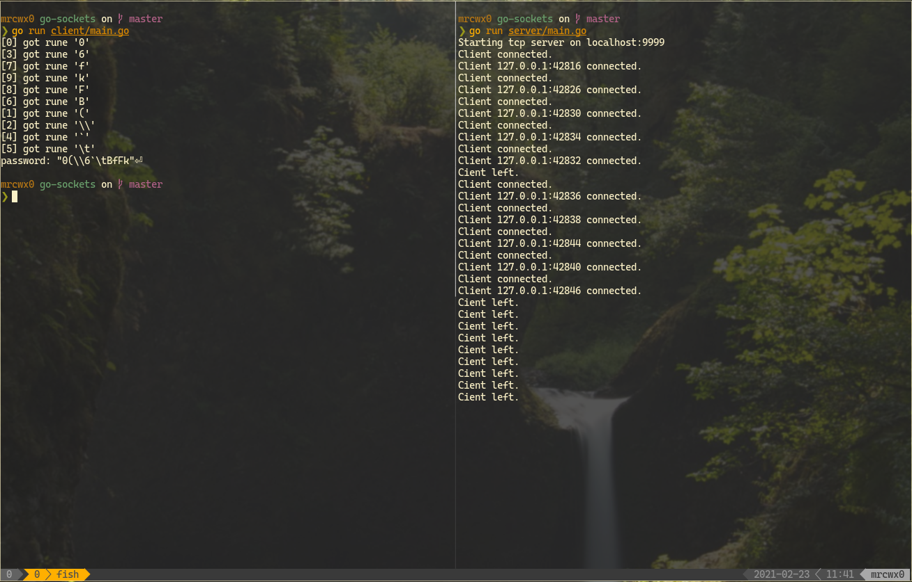

# go-sockets

This is a basic client-server implementation in which the server asks for a password and
gives a hint of which characters are OK through 1s and 0s. The client takes advantage of golang channels and goroutines to spawn multiple connections which target a single index into the password, speeding up the process by a lot.


## How to run

First run the server:
```sh
go run server/main.go
```

Then, in another terminal, run the client:

```sh
go run client/main.go
```

## Extra notes

Through the source code you can see that the password is a constant in the server and it doesn't exist on the client, but the client is able to generate it pretty quickly.

## Example run

